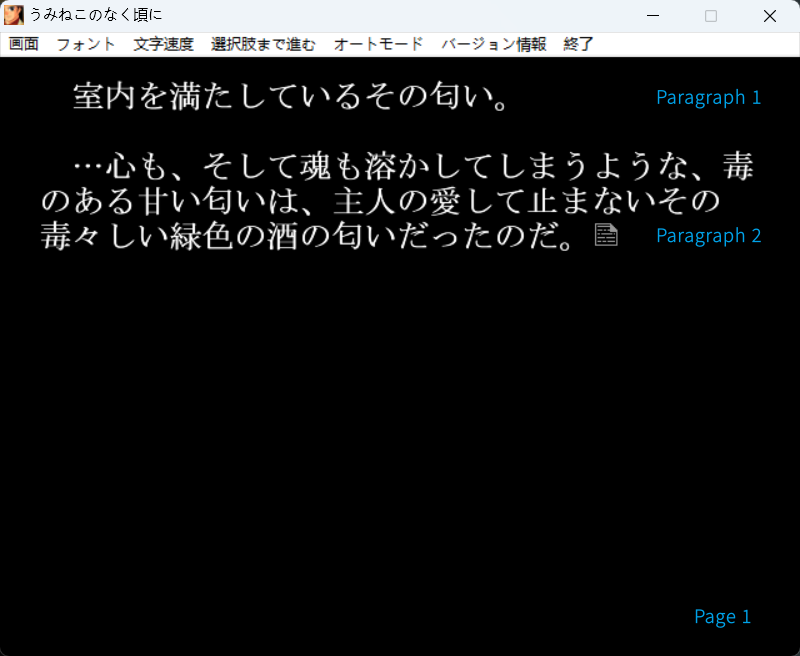

<p align="center">
  
</p>

<h1 align="center">EasyPlayscript</h1>

<p align="center">
  A C# type-safe playscript writing DSL designed for bridging the gap between texts and codes in NVL game development. Still in early development.
</p>

<p align="center">
  
  
  
  
  
  
</p>

---

## Overview

EasyPlayscript lets you write game dialogue, UI text, and event scripts in a human-readable `.scpt` format (sorry AppleScript, wasn't knowing ya at the time I selected the extension) while keeping everything type-safe at compile time. A Roslyn source generator reads your scripts and generates the C# wiring — service dispatch, registry, navigation — so you never hand-write boilerplate.

EasyPlayscript focuses on playscript and text writing,
while the C# side provides type-safe contracts.
You describe and call functions in your `.scpt` files just like you would call interfaces in code.
The actual business logic is delegated to and lives in C#, keeping scripts clean and focused on narrative flow.

At build time, `.scpt` files are compiled to MessagePack for efficient runtime loading, with optional AES encryption to protect script content.

The two-pass ANTLR parser extracts structure first (blocks & interface definitions), 
then content (consumer calls, text). This enables incremental LSP editing and fast rebuilds.

## Before Quick Start ...

### Script

A **script** is a block of paged narrative content — dialogue, cutscenes, event sequences. The content inside a script is organized in three layers:

- **Line** — a single unit of text. This is what `RenderNextLine()` returns (as a `LineRenderResult`). Lines can be split into segments using `+` (see Line Segments below).
- **Paragraph** — a group of consecutive lines, separated by a blank line. `RenderNextParagraph()` returns all lines in a paragraph joined by newlines.
- **Page** — a group of paragraphs, separated by `/`. `RenderNextPage()` returns all paragraphs on a page.

<p align="center">
  
  <br/>
  <em>An example of "paged narrative content".</em>
</p>

```
script act_i_scene_i [
    When shall we three meet again?           // Pg 0, Para 0, Line 0
    In thunder, lightning, or in rain?        // Pg 0, Para 0, Line 1

    When the hurly-burly's done,              // Pg 0, Para 1, Line 0
    When the battle's lost and won.           // Pg 0, Para 1, Line 1
    /                                         // --- page break ---
                                              
    That will be ere the set of sun.          // Pg 1, Para 0, Line 0

    Where the place?                          // Pg 1, Para 1, Line 0
    Upon the heath.                           // Pg 1, Para 1, Line 1
    There to meet with Macbeth.               // Pg 1, Para 1, Line 2
    /                                         // --- page break ---
                                              
    Fair is foul, and foul is fair;           // Pg 2, Para 0, Line 0
    Hover through the fog and filthy air.     // Pg 2, Para 0, Line 1
]
```

Page 0 is the opening exchange. Page 1 continues the prophecy. Page 2 climaxes with "Fair is foul."

#### Line Segments

Lines can be split into segments using `+` as an inline delimiter. Each segment is a part of the line. Use `RenderNextLineSegment()` to iterate segment-by-segment; `RenderNextLine()` concatenates all segments.

```
script dialogue [
    Hello, +World!
    Goodbye, +Cruel World...
]
```

`RenderNextLineSegment()` returns `"Hello, "`, then `"World!"`, then `"Goodbye, "`, then `"Cruel World..."`. `SegmentRenderResult` carries segment-level boundary flags: `IsLastSegmentOfLine`, `IsLastSegmentOfParagraph`, `IsLastSegmentOfPage`, `IsLastSegmentOfScript`.

To use a literal `+` in a segment (not a delimiter), escape it: `\+`.

Scripts are compiled to MessagePack at build time. At runtime, you can navigate them step by step:

```csharp
var script = session.GetScript(PlayscriptRuntimeSession.ScriptKey.act_i_scene_i);
script.RenderNextLine()!.Text        // "When shall we three meet again?"
script.RenderNextLine()!.Text        // "In thunder, lightning, or in rain?"
script.RenderNextParagraph()!.Text   // "When the hurly-burly's done,\nWhen the battle's lost and won."
script.RenderNextPage()!.Text        // from "That will be ere the set of sun." to "There to meet with Macbeth."
```

Or just run everything at once with `script.Run()`.

### Interface

An **interface** is a function signature declared at the top of a `.scpt` file. It defines *what* the script can call, but not *how* — the actual logic lives in C#.

```
interface enter(description: string) : void
interface exit(description: string) : void
interface effect(name: string, intensity: decimal) : void
interface set_music(track: string) : void
```

Think of it as a contract between the script writer and the programmer. The script writer says "I need an `effect` function that takes a name and intensity," and the C# side provides it. Parameters and return types are type-checked at compile time.

The `async` variant requires the C# implementation to return `Task<T>` (or `Task` for `void`). Async interfaces are properly awaited when using `RunAsync()` / `RenderNextLineAsync()`.

### Consumer call

A **consumer call** is how a script invokes an interface. It's written with an `@` prefix inside a script or text block:

```
script act_i_scene_i[
@effect("thunder", 1.0)
@enter("Thunder and Lightning. Enter three Witches.")

When shall we three meet again?
In thunder, lightning, or in rain?

When the hurly-burly's done,
When the battle's lost and won.

That will be ere the set of sun.

Fair is foul, and foul is fair;
Hover through the fog and filthy air.

@exit("They exit.")
]
```

Notice how the dialogue is just plain text — no quotes, no `@`. This is what the player sees. The `@` calls (`@effect`, `@enter`, `@exit`) are side effects handled by the game engine — playing thunder sounds, animating stage entrances, triggering transitions. The script stays focused on narrative; the C# side handles everything else.

At compile time, every consumer call is validated against declared interfaces:
- Wrong name → error (SCPT005: undeclared consumer call)
- Wrong argument count → error (SCPT008)
- Wrong argument types → error (SCPT007)

This means script writers get the same safety net as writing C# code — typos and mismatches are caught before the game ever runs.

### Text

A **text** block is for static content — play titles, credits, UI labels — anything that isn't paged dialogue.

```
text playbill[
The Tragedie of Macbeth
by William Shakespeare
]

text act_header[
Act I
]
```

Texts support consumer calls but have no pages or paragraphs. They're rendered in one call:

```csharp
string title = session.GetText(PlayscriptRuntimeSession.TextKey.playbill).Render();
```

### Implementation

An **implementation** is a C# method decorated with `[Implementation]` that provides the body for an interface declared in a `.scpt` file.

```csharp
public class StageSystem
{
    [Implementation]
    public void enter(string description)
    {
        Console.WriteLine($"  [stage] {description}");
        // animate characters onto stage
    }

    [Implementation]
    public void exit(string description)
    {
        Console.WriteLine($"  [stage] {description}");
        // animate characters off stage
    }

    [Implementation]
    public void effect(string name, double intensity)
    {
        Console.WriteLine($"  [effect] {name} (intensity: {intensity})");
        // play thunder, lightning, fog, etc.
    }

    [Implementation]
    public void set_music(string track)
    {
        Console.WriteLine($"  [music] now playing: {track}");
        // crossfade to new track
    }
}
```

The source generator wires every consumer call `@effect("thunder", 1.0)` in your scripts to the matching `[Implementation]` method. If an interface has no implementation, you get a compile-time error (SCPT009).

### Session

A **session** (`PlayscriptRuntimeSession`) is the runtime entry point. It holds your registered implementations and provides access to scripts and texts.

```csharp
var session = new PlayscriptRuntimeSession();
session.Register(new StageSystem());

session.GetScript(PlayscriptRuntimeSession.ScriptKey.act_i_scene_i).Run();
string title = session.GetText(PlayscriptRuntimeSession.TextKey.playbill).Render();
```

Sessions support **parent-child scoping**. A child session inherits all services from its parent and can override specific ones — useful for scene-specific behavior without duplicating registration:

```csharp
var global = new PlayscriptRuntimeSession();
global.Register(new StageSystem());

var actV = global.CreateChild();
actV.Register(new StageSystem()); // same type, different instance — e.g. with different music state
```

### Source generator

The **source generator** is a Roslyn `IIncrementalGenerator` that runs at compile time. It reads your `.scpt` files and emits C# code:

| Generated file | Contents |
|----------------|----------|
| `PlayscriptRegistry.g.cs` | `DispatchCall()` — switch that routes consumer calls to implementations |
| `PlayscriptRuntime.g.cs` | `PlayscriptRuntimeSession` class, enums for script/text keys, lazy loader |
| `Script.g.cs` | `Script` class with `Run()`, `RenderNextLineSegment()`, `RenderNextLine()` returning render results, navigation |
| `Text.g.cs` | `Text` class with `Render()` |

You never see or touch these files — they're generated fresh every build.

### Two-pass parser

The ANTLR parser processes `.scpt` files in two passes:

1. **Pass 1 (structure)** — extracts block types, names, page/paragraph boundaries, interface declarations
2. **Pass 2 (content)** — parses the actual script/text content inside `[...]` blocks

This split exists for performance. The LSP server can re-parse only the blocks whose content changed, skipping the structure pass entirely for unaffected blocks.

## Quick Start

### 1. Write a `.scpt` file

```
interface enter(description: string) : void
interface exit(description: string) : void
interface effect(name: string, intensity: decimal) : void

script act_i_scene_i[
@effect("thunder", 1.0)
@enter("Thunder and Lightning. Enter three Witches.")

When shall we three meet again?
In thunder, lightning, or in rain?

When the hurly-burly's done,
When the battle's lost and won.

That will be ere the set of sun.

Where the place?
Upon the heath.
There to meet with Macbeth.

Fair is foul, and foul is fair;
Hover through the fog and filthy air.

@exit("They exit.")
]
```

### 2. Implement the services in C\#

```csharp
using EasyPlayscript.Runtime;

public class StageSystem
{
    [Implementation]
    public void enter(string description)
    {
        Console.WriteLine($"  [stage] {description}");
    }

    [Implementation]
    public void exit(string description)
    {
        Console.WriteLine($"  [stage] {description}");
    }

    [Implementation]
    public void effect(string name, double intensity)
    {
        Console.WriteLine($"  [effect] {name} (intensity: {intensity})");
    }
}
```

### 3. Run it

```csharp
using EasyPlayscript.Generated;

var session = new PlayscriptRuntimeSession();
session.Register(new StageSystem());

var script = session.GetScript(PlayscriptRuntimeSession.ScriptKey.act_i_scene_i);
while (script.RenderNextLine() is { } line)
    Console.WriteLine(line.Text);
```

Output:

```
  [effect] thunder (intensity: 1)
  [stage] Thunder and Lightning. Enter three Witches.
When shall we three meet again?
In thunder, lightning, or in rain?
When the hurly-burly's done,
When the battle's lost and won.
That will be ere the set of sun.
...
Fair is foul, and foul is fair;
Hover through the fog and filthy air.
  [stage] They exit.
```

## `.scpt` Syntax

### Interfaces

```
interface enter(description: string) : void
interface effect(name: string, intensity: decimal) : void
interface set_music(track: string) : void
async interface fetch_character(name: string) : string
```

- Declares consumer calls the script can invoke via `@name(args)`
- `async interface` requires `Task<T>` implementations; the generated `RunAsync()` / `RenderNextLineAsync()` properly await them

### Scripts

```
script act_i_scene_i[
@effect("thunder", 1.0)
@enter("Thunder and Lightning. Enter three Witches.")

When shall we three meet again?

When the hurly-burly's done,
When the battle's lost and won.
/

That will be ere the set of sun.
@exit("They exit.")
]
```

- `@name(args)` — consumer call dispatched to a registered `[Implementation]` method
- Plain text — dialogue and stage directions visible to the player
- `+` — segment delimiter (splits a line into segments; use `RenderNextLineSegment()` to iterate)
- Blank line — paragraph separator
- `/` — page separator

### Text blocks

```
text playbill[
The Tragedie of Macbeth
by William Shakespeare
]
```

- Static text blocks rendered via `session.GetText(key).Render()`

## Project Structure

| Project | Target | Description |
|---------|--------|-------------|
| `EasyPlayscript.Core` | netstandard2.0 | ANTLR parsers, data models, validation, `ScriptNavigator` |
| `EasyPlayscript.Generator` | netstandard2.0 | Roslyn `IIncrementalGenerator` — emits all `.g.cs` files |
| `EasyPlayscript.BuildTask` | netstandard2.0 | MSBuild task for binary `.scpt` compilation |
| `EasyPlayscript.LSP` | net10.0 | OmniSharp-based language server |
| `EasyPlayscript.Tests` | net9.0 | xUnit tests for Core + Generator |
| `EasyPlayscript.LSP.Tests` | net10.0 | xUnit tests for LSP |
| `EasyPlayscript.Sample` | net9.0 | Demo app with sample `.scpt` scripts |

## LSP Server

The LSP server provides editor integration for `.scpt` files:

- **Incremental sync** — only re-parses changed blocks
- **Semantic tokens** — syntax highlighting for interfaces, scripts, consumer calls
- **Diagnostics** — undeclared calls, type mismatches, duplicates

Run it directly:

```bash
dotnet run --project EasyPlayscript.LSP
```

Or configure it in your editor as an LSP server executable.

## Building

**Requires .NET 10.0.301** (see `global.json`).

```bash
# Build everything
dotnet build

# Run all tests
dotnet test

# Run specific test project
dotnet test EasyPlayscript.Tests

# Run the sample
dotnet run --project EasyPlayscript.Sample

# Rebuild & repack NuGet packages for local development
./pack-local.ps1
```

### Parent-child sessions

```csharp
var global = new PlayscriptRuntimeSession();
global.Register(new StageSystem());

var actV = global.CreateChild();
actV.Register(new StageSystem()); // override for Act V's different mood/music
actV.GetScript(key).Run();        // uses Act V's StageSystem
global.GetScript(key).Run();      // still uses the original
```

### Script navigation

```csharp
var script = session.GetScript(key);

var result = script.RenderNextLineSegment();  // SegmentRenderResult? — null at end of script
if (result is { } r)
{
    r.Text                                // "Hello, "
    r.Pointer                             // ScriptPointer(0, 0, 0)
    r.IsLastSegmentOfLine                 // false
    r.IsLastPage                          // false
}

var lineResult = script.RenderNextLine();     // LineRenderResult? — all segments concatenated
script.RenderNextParagraph()              // ParagraphRenderResult? — lines joined by newline
script.RenderNextPage()                   // PageRenderResult? — paragraphs joined by blank line
script.JumpTo(new ScriptPointer(page, paragraph, line))
script.Reset()                            // rewinds to (0,0,0)
script.IsLastLineOfPage                   // bool (live navigator state)
```

- Each `Render*` method returns a different sealed type — `SegmentRenderResult`, `LineRenderResult`, `ParagraphRenderResult`, or `PageRenderResult`
- Use `is SegmentRenderResult` pattern matching to access type-specific flags
- Flags are captured **before** the pointer advances
- `RenderNextLineSegment` includes 4 segment-level boundary flags; `RenderNextLine` includes all 6 line-level flags; `RenderNextParagraph` includes paragraph/page flags; `RenderNextPage` includes only `IsLastPage`

### Async interfaces

```
async interface fetch_character(name: string) : string
```

```csharp
// Implementation must return Task<T>
[Implementation]
public async Task<string> fetch_character(string name)
{
    return await _db.GetCharacterBioAsync(name);
}

// Use async render to properly await
while (await script.RenderNextLineAsync() is { } line)
    Console.WriteLine(line.Text);
```

## License

[MIT](LICENSE)
