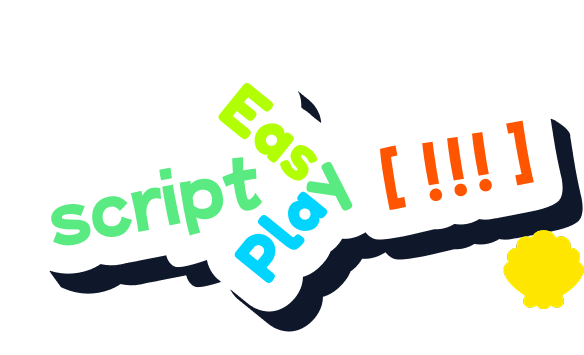

<p align="center">
  
</p>

<h1 align="center">EasyPlayscript</h1>

<p align="center">
  A C# type-safe playscript writing DSL designed for bridging the gap between texts and codes in NVL game development. Still in early development.
</p>

<p align="center">
  
  
  
  
  
  
</p>

---

## Overview

EasyPlayscript lets you write game dialogue, UI text, and event scripts in a human-readable `.scpt` format (sorry AppleScript, wasn't knowing ya at the time I selected the extension) while keeping everything type-safe at compile time. A Roslyn source generator reads your scripts and generates the C# wiring — service dispatch, registry, navigation — so you never hand-write boilerplate.

The core philosophy is simple: EasyPlayscript focuses on playscript and text writing, while the C# side provides type-safe contracts. You describe and call functions in your `.scpt` files just like you would call interfaces in code — `@play("bgm", 0.8)` maps directly to a real method. The actual business logic is delegated to and lives in C#, keeping scripts clean and focused on narrative flow.

The two-pass ANTLR parser extracts structure first (blocks, pages, paragraphs), then content (consumer calls, text). This enables incremental LSP editing and fast rebuilds.

## Features

- **Type-safe consumer calls** — `@play("bgm", 0.8)` maps to a real C# method; mismatches are caught at compile time
- **Roslyn source generator** — generates `DispatchCall`, `Script`, `Text`, and `PlayscriptRuntimeSession` from `.scpt` files
- **MSBuild integration** — `.scpt` files are compiled to binary (optional AES encryption) at build time
- **Async interface support** — `async interface fetch_user_name(...)` generates `Task<T>` dispatch with proper `await`
- **Parent-child service scoping** — child sessions inherit and can override services from parents
- **Pointer-based script navigation** — `RenderNextLine()`, `JumpTo()`, `Reset()`, `IsLastLineOfPage`, etc.
- **LSP server** — OmniSharp-based language server with incremental sync, semantic tokens, and diagnostics
- **Two-pass parsing** — structure extraction for fast incremental re-parsing when only content changes

## Quick Start

### 1. Write a `.scpt` file

```
interface transition(type: string) : void
interface play(sound: string, volume: decimal) : void
interface get_name() : string

script intro[
@transition("fade_in")
从前有座山，山里有座庙。

庙里有个老和尚，在给小和尚讲故事。
@play("sfx_page_turn", 1.0)
/

讲什么故事呢？
@get_name()，欢迎来到这个世界。
]
```

### 2. Implement the services in C\#

```csharp
using EasyPlayscript.Runtime;

public class AudioSystem
{
    [Implementation]
    public void play(string sound, double volume)
    {
        // play the sound
    }

    [Implementation]
    public string get_name() => "旅行者";
}

public class UiSystem
{
    [Implementation]
    public void transition(string type)
    {
        // run the transition
    }
}
```

### 3. Run it

```csharp
using EasyPlayscript.Generated;

var session = new PlayscriptRuntimeSession();
session.Register(new AudioSystem());
session.Register(new UiSystem());

var script = session.GetScript(PlayscriptRuntimeSession.ScriptKey.intro);
while (script.RenderNextLine() is { } line)
    Console.WriteLine(line);
```

## `.scpt` Syntax

### Interfaces

```
interface play(sound: string, volume: decimal) : void
interface get_name() : string
async interface fetch_user_name(user_id: int) : string
```

- Declares consumer calls the script can invoke via `@name(args)`
- `async interface` requires `Task<T>` implementations; the generated `RunAsync()` / `RenderNextLineAsync()` properly await them

### Scripts

```
script my_script[
  First line of text.

  Second paragraph (separated by blank line).
  @play("sfx", 1.0)
  /

  This is page 2 (separated by `/`).
]
```

- `@name(args)` — consumer call dispatched to a registered `[Implementation]` method
- Blank line — paragraph separator
- `/` — page separator

### Text blocks

```
text welcome[
  Hello, welcome!
  @get_name(), enjoy your stay.
]
```

- Static text blocks rendered via `session.GetText(key).Render()`

## Project Structure

| Project | Target | Description |
|---------|--------|-------------|
| `EasyPlayscript.Core` | netstandard2.0 | ANTLR parsers, data models, validation, `ScriptNavigator` |
| `EasyPlayscript.Generator` | netstandard2.0 | Roslyn `IIncrementalGenerator` — emits all `.g.cs` files |
| `EasyPlayscript.BuildTask` | netstandard2.0 | MSBuild task for binary `.scpt` compilation |
| `EasyPlayscript.LSP` | net10.0 | OmniSharp-based language server |
| `EasyPlayscript.Tests` | net9.0 | xUnit tests for Core + Generator |
| `EasyPlayscript.LSP.Tests` | net10.0 | xUnit tests for LSP |
| `EasyPlayscript.Sample` | net9.0 | Demo app with sample `.scpt` scripts |

## LSP Server

The LSP server provides editor integration for `.scpt` files:

- **Incremental sync** — only re-parses changed blocks
- **Semantic tokens** — syntax highlighting for interfaces, scripts, consumer calls
- **Diagnostics** — undeclared calls, type mismatches, duplicates

Run it directly:

```bash
dotnet run --project EasyPlayscript.LSP
```

Or configure it in your editor as an LSP server executable.

## Building

**Requires .NET 10.0.301** (see `global.json`).

```bash
# Build everything
dotnet build

# Run all tests
dotnet test

# Run specific test project
dotnet test EasyPlayscript.Tests

# Run the sample
dotnet run --project EasyPlayscript.Sample

# Rebuild & repack NuGet packages for local development
./pack-local.ps1
```

### Parent-child sessions

```csharp
var global = new PlayscriptRuntimeSession();
global.Register(new AudioSystem());

var combatScene = global.CreateChild();
combatScene.Register(new CombatAudio()); // overrides AudioSystem in this scope
combatScene.GetScript(key).Run();        // uses CombatAudio
global.GetScript(key).Run();             // still uses original AudioSystem
```

### Script navigation

```csharp
var script = session.GetScript(key);

script.RenderNextLine()          // returns string? — dispatches calls + returns text
script.RenderNextParagraph()     // lines joined by newline
script.RenderNextPage()          // paragraphs joined by blank line
script.JumpTo(new ScriptPointer(page, paragraph, line))
script.Reset()                   // rewinds to (0,0,0)
script.IsLastLineOfPage          // bool
```

### Async interfaces

```
async interface fetch_user_name(user_id: int) : string
```

```csharp
// Implementation must return Task<T>
[Implementation]
public async Task<string> fetch_user_name(int user_id)
{
    return await _db.GetUserNameAsync(user_id);
}

// Use async render to properly await
while (await script.RenderNextLineAsync() is { } line)
    Console.WriteLine(line);
```

## License

[MIT](LICENSE)
